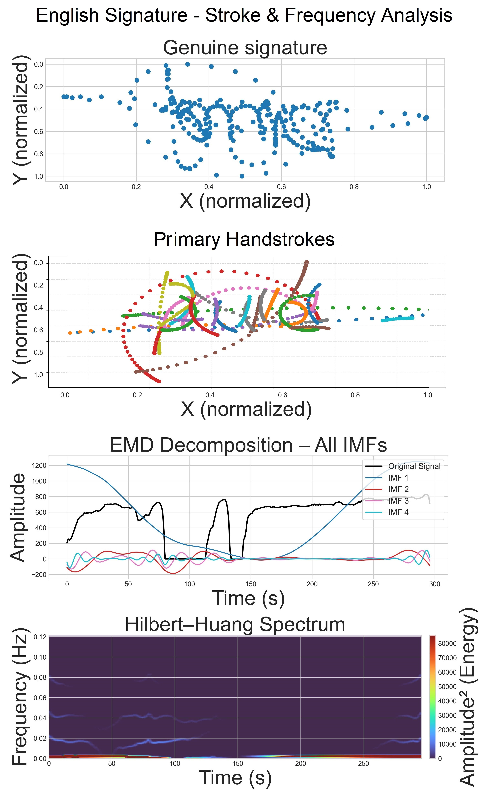
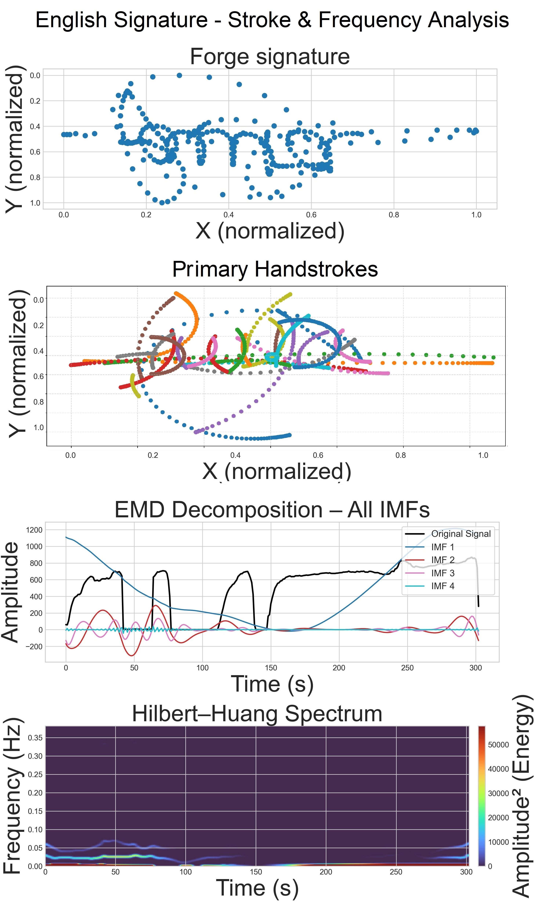
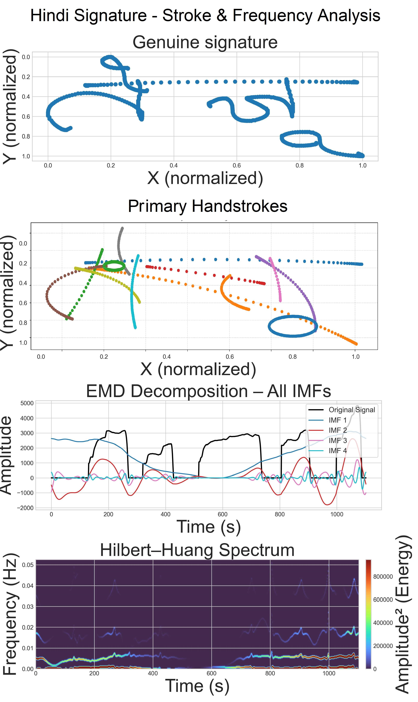
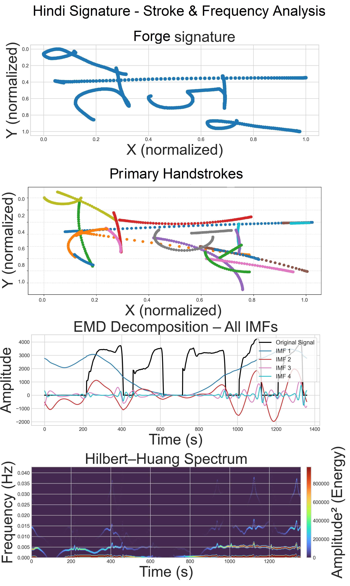
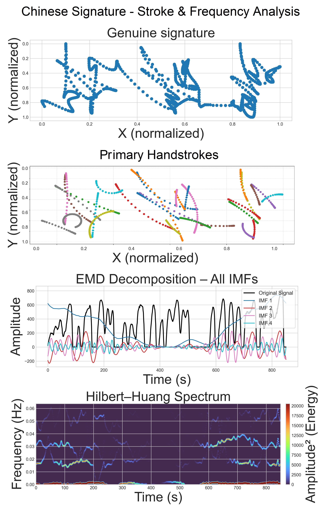
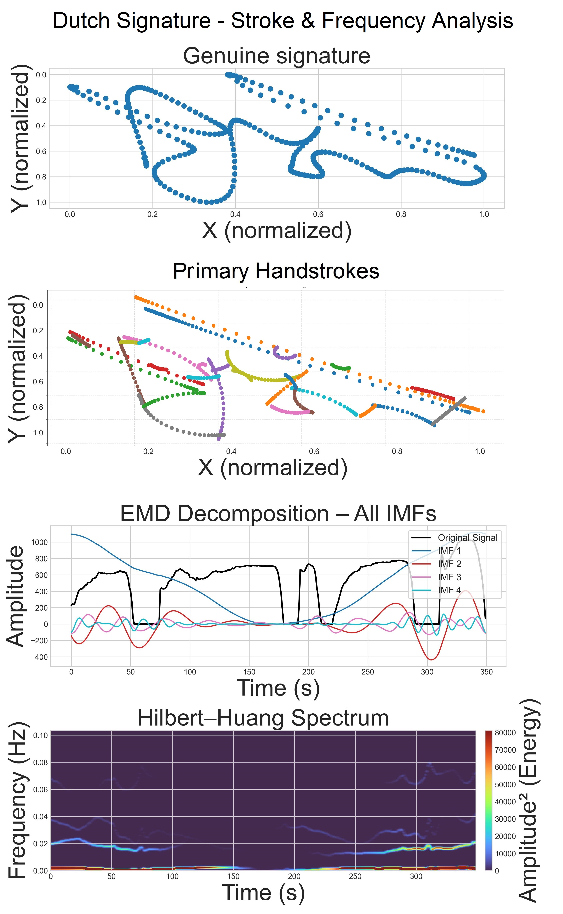
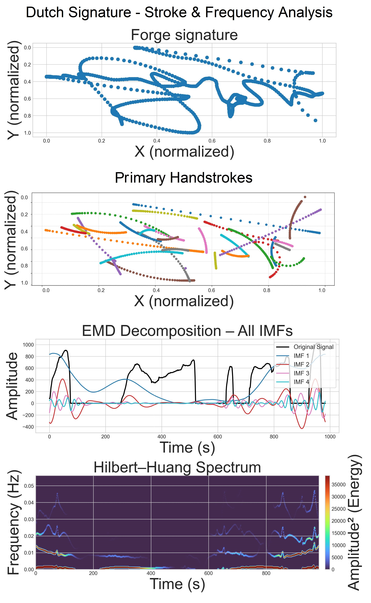

# HASTAKSHAR: A Generalized Framework for Deciphering Cross-Script Signatures via Multimodal Fusion

## Installation

```bash
pip install -r requirements.txt
```

## Introduction

Online signature verification has become central to secure digital transactions, offering richer behavioral cues than traditional offline signatures. Modern devices capture a signer’s dynamics — motion, pressure, rhythm, and stroke formation — making it possible to distinguish genuine writing from both human and AI-generated forgeries. However, variations in writing style, script complexity, and neuromotor behavior still limit the reliability of current systems, especially when attackers can synthesize highly convincing digital forgeries.

To address these challenges, we introduce Hastakshar, a multimodal signature verification framework designed to learn both the structural and temporal characteristics of handwriting. Hastakshar converts each signature into two complementary representations: (1) sigma-lognormal stroke tokens, modeling neuromuscular motion patterns, and (2) Hilbert-based pressure descriptors derived from Ensemble Empirical Mode Decomposition (EEMD). These representations capture stroke geometry, signing intent, surface interaction, and micro-variations that are difficult to imitate.

A multistream Transformer with cross-attention integrates these signals into a unified embedding space optimized for detecting subtle inconsistencies between genuine and forged signatures. The system is evaluated on multiple scripts — English, Dutch, Chinese, and Hindi — demonstrating strong generalization across languages and writing styles.

Hastakshar delivers improved verification accuracy, enhanced resistance to synthetic forgeries, and interpretable insights through its stroke-decomposition and pressure-spectral representations, offering a robust foundation for next-generation signature security.

## Performance of EER (80:20 vs 1:4)

| Database            | No. of Signatures | Train (80:20) | EER (80:20)<br>Strokes + Sigma-Lognormal + HHT | Train (1:4) | EER (1:4)<br>Strokes + Sigma-Lognormal + HHT |
|--------------------|-------------------|---------------|-----------------------------------------------|-------------|----------------------------------------------|
| SigComp11 Chinese  | 130               | 104           | **1.2615**                                     | 1 / 1       | **1.633**                                    |
| SigComp11 Dutch    | 120               | 95            | **0.2518**                                     | 1 / 1       | **1.9089**                                   |
| DeepSign DB        | 1526              | 1220          | **1.5986**                                     | 1 / 4       | **1.6035**                                   |
| Hindi (HinSig)     | 2500              | 200           | **1.4827**                                     | 3 / 2       | **1.8817**                                   |

## Figures

### Figure 1 — Structure, Stroke and Pressure analysis curve for genuine and forged signatures in Latin script English language from DeepSignDB dataset
<table> <tr> <td></td> <td></td> </tr> </table>

### Figure 2 — Structure, Stroke and Pressure analysis curve for genuine and forged signatures in Devanagari script Hindi language from HinSig
Dataset
<table> <tr> <td></td> <td></td> </tr> </table>

### Figure 3 — Structure, Stroke and Pressure analysis curve for genuine and forged signatures in Chinese (Hanzi Script) from SigComp11 Chinese
<table> <tr> <td></td> <td></td> </tr> </table>

### Figure 4 — Structure, Stroke and Pressure analysis curve for genuine and forged signatures in Latin Script Dutch Language from SigComp11 Dutch
<table> <tr> <td></td> <td></td> </tr> </table>
